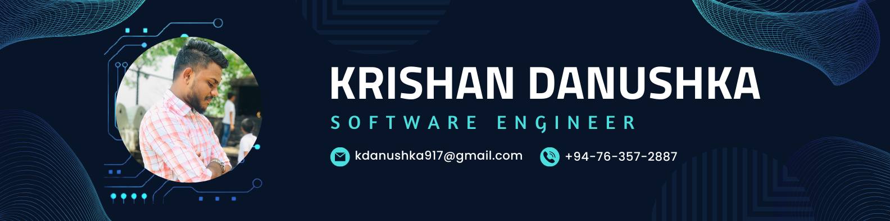

  

# Hi there! I'm Krishan Danushka 👋🏼
### Full Stack Developer | AI Enthusiast | Software Engineering Student

## 🚀 About Me

- 💻 **Passionate Full Stack Developer** specializing in modern web technologies
- 🎓 **3rd-year Software Engineering Student** at Staffordshire University, England
- 🤖 **Aspiring ML & AI Engineer** with hands-on experience in computer vision
- 🔭 **Currently working on:** Machine Learning projects, Web Development, and Mobile Apps
- 🌱 **Always learning:** Advanced AI techniques, cloud technologies, and emerging frameworks
- 🎯 **Goal:** Building innovative, user-centric applications that solve real-world problems
- 💖 **Relationship status:** Committed to Neural Networks and cutting-edge tech
- 🎵 **Fun fact:** Love rap music and classic hits

## 🛠️ Tech Arsenal

### **Languages**

### **Frontend Development**

### **Backend & Mobile**

### **AI/ML & Data Science**

### **Cloud & Database**

### **Tools & Others**

## 📊 GitHub Analytics

  <table>
    <tr>
      <td>
        
      </td>
      <td>
        
      </td>
    </tr>
    <tr>
      <td colspan="2" align="center">
        
      </td>
    </tr>
  </table>

## 🏆 GitHub Trophies

  

## 🤝 Let's Connect!

  

## ✨ Fun Contribution Snake

<picture>
  <source media="(prefers-color-scheme: dark)" srcset="https://raw.githubusercontent.com/krishanSKDA/krishanSKDA/output/github-snake-dark.svg" />
  <source media="(prefers-color-scheme: light)" srcset="https://raw.githubusercontent.com/krishanSKDA/krishanSKDA/output/github-snake.svg" />
  
</picture>

---

  <i>💡 "The best time to plant a tree was 20 years ago. The second best time is now." - Chinese Proverb</i>
    
  <b>Thanks for visiting! Let's build something amazing together! 🚀</b>

