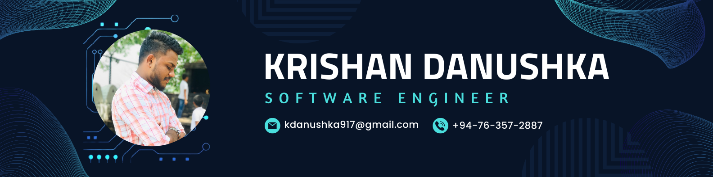

  

# Hi there! I'm Krishan Danushka 👋🏼
### AI/ML Engineer & Full-Stack Developer | Software Engineering Graduate

## 🚀 About Me

- 🤖 **AI/ML Engineer** building LLM-powered apps, RAG pipelines, and agentic AI systems
- 🦾 **Edge AI Specialist** - deploying models on Raspberry Pi, NVIDIA Jetson Orin Nano & DGX Spark
- 🎓 **BEng (Hons) Software Engineering** graduate from Staffordshire University, England
- 🧠 **Core focus:** Agentic AI, computer vision, MLOps pipelines, and intelligent full-stack platforms
- 🛸 **Side interests:** FPV drones, photography, and stock trading on the Colombo Stock Exchange
- 🎵 **Fun fact:** Love rap music and classic hits

## 🛠️ Tech Arsenal

### **AI & Machine Learning**

### **LLM & Agentic AI**

### **Backend & APIs**

### **Frontend & Mobile**

### **Databases**

### **DevOps & MLOps**

### **Cloud & Infrastructure**

### **Tools & Practices**

## 🏆 Featured Projects

| Project | Stack | Highlight |
|---|---|---|
| 🛸 **Autonomous UAV Flight System** | MAVLink, PX4, ROS2, NVIDIA Jetson | Real-time telemetry & autonomous waypoint navigation |
| 🤖 **Buddy AI Agent** | FastAPI, Flutter, React, WebSocket, Firebase | Production conversational AI with real-time STT |
| 🐘 **HECGuard** | YOLOv8, Raspberry Pi 4, FastAPI, React Native | 93–94% mAP elephant detection  |
| 🔍 **GeoIntel OSINT Platform** | CesiumJS, FastAPI, WebSocket | Real-time geospatial intelligence (Google Earth × Palantir) |
| 🎨 **AI Criminal Sketch System** | ComfyUI, FastAPI, React, PostgreSQL | Forensic AI tool for suspect sketch generation |
| ⚙️ **MLOps Pipeline** | Kubernetes, MLflow, ArgoCD, Prometheus/Grafana | Production-grade ML infrastructure on Minikube |

## 🤝 Let's Connect!

## ✨ Fun Contribution Snake

<picture>
  <source media="(prefers-color-scheme: dark)" srcset="https://raw.githubusercontent.com/krishanSKDA/krishanSKDA/output/github-snake-dark.svg" />
  <source media="(prefers-color-scheme: light)" srcset="https://raw.githubusercontent.com/krishanSKDA/krishanSKDA/output/github-snake.svg" />
  
</picture>

---

  <i>💡 "The best time to plant a tree was 20 years ago. The second best time is now." - Chinese Proverb</i>
    
  <b>Thanks for visiting! Let's build something amazing together! 🚀</b>

